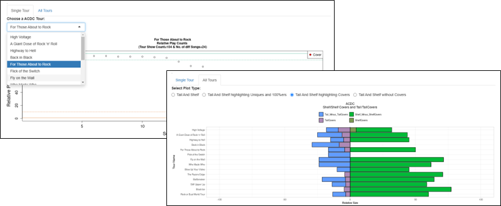
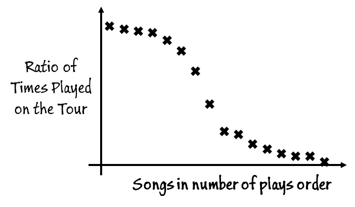
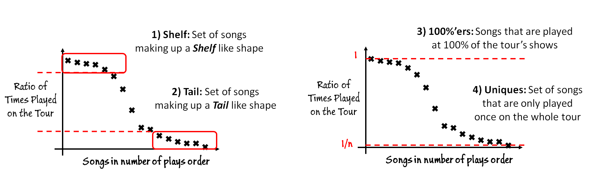

# Setlist Variety

Greatest Hits Versus Deep Cuts: Exploring Variety in Set-lists Across Artists and Musical Genres.

The work is to be presented at the [CHR 2024 Conference](https://2024.computational-humanities-research.org/), for full details and discussions see the [Paper Here](https://ceur-ws.org/Vol-3834/paper102.pdf)

## Interactive Interface

We are currently working upon an interactive interface of the paper's analysis, to explore the data for yourself [Try out the interface Here](https://edabel.shinyapps.io/setlist-variety/). In the interface you can explore any of the different artist's in the data set and see how your favourite artists compare with respect to setlist variety.

## Shelf and Tail Analysis of a Tour's Data

For an artist's tour we can plot the number of times all of the songs played on the tour are played. The more songs played again and again at shows suggest Less Variety, whilst in comparison the more songs played less often suggest More Variety.

Given the total number of shows for a tour, we can calculate ratio versions of the number of plays, where 1 would represent songs that are played at every single one of a tour's shows. A tour’s songs could be sorted and arranged Ordered by their number of ratio plays as shown below.

From such a visualisation of a tour's data, we can see specific interesting properties

1.  Shelf

2.  Tail

3.  100'%ers

4.  Uniques

5.  Covers

## Single Tour Analysis

From such notions we can explore analysis of a Single tour

## Whole Artist Career Analysis

From such notions we can explore an artist's career.

## Artist Comparisons

This can be further extended to compare variety between a whole set of artists.

## Data

The set of artists in the initial dataset consists of hundreds of artists and thousands of tours.
