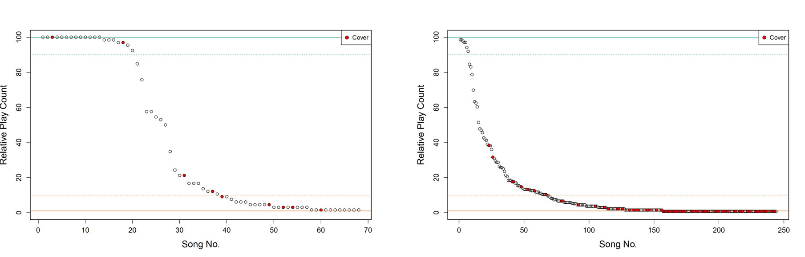
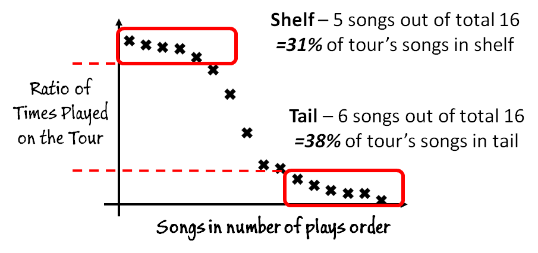
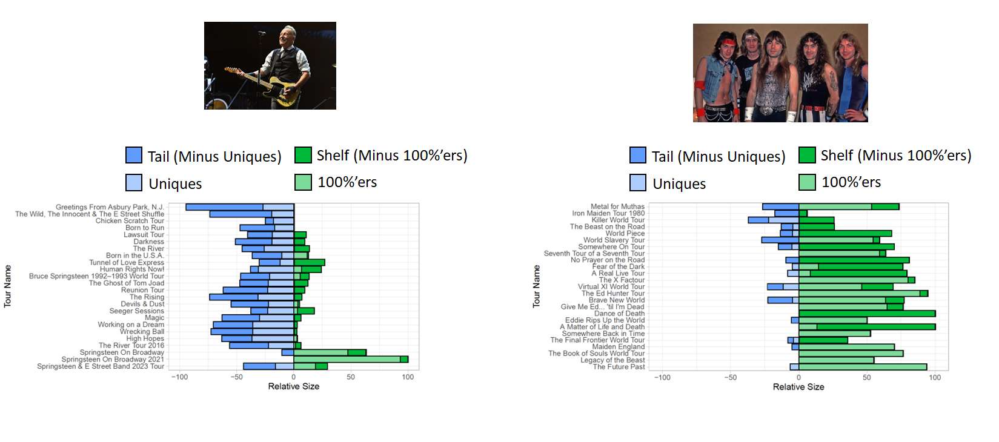
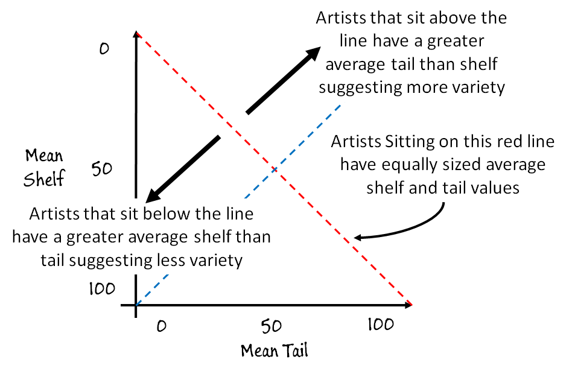

# Greatest Hits Versus Deep Cuts: Exploring Variety in Set-lists Across Artists and Musical Genres.

This is the github repository to accompany the **"Greatest Hits Versus Deep Cuts: Exploring Variety in Set-lists Across Artists and Musical Genres"** Research Paper work to be presented at the [CHR 2024 Conference](https://2024.computational-humanities-research.org/), for full details and discussions see the [Paper Here](https://ceur-ws.org/Vol-3834/paper102.pdf)

## Interactive Interface

We are currently working upon an interactive interface of the paper's analysis, to explore the data for yourself, try out the interface [Here](https://edabel.shinyapps.io/setlist-variety/). In the interface you can explore any of the different artist's in the data set and see how your favourite artists compare with respect to setlist variety.

## Shelf and Tail Analysis of a Tour's Data

For an artist's tour we can plot the number of times all of the songs played on the tour are played. The more songs played again and again at shows suggest Less Variety, whilst in comparison the more songs played less often suggest More Variety.

Given the total number of shows for a tour, we can calculate ratio versions of the number of plays, where 1 would represent songs that are played at every single one of a tour's shows. A tour’s songs could be sorted and arranged Ordered by their number of ratio plays as shown below.

From such a visualisation of a tour's data, we can see specific interesting properties:

1.  Shelf: A set of songs making up a Shelf like shape. Denoting songs that areplayed at most of the tour's shows

2.  Tail: Set of songs making up a Tail like shape. Denoting songs that are played only rarely on the tour

3.  100'%ers: Songs that are played at 100% of the tour’s shows. Denoting songs that are played at 100% of the tour's shows

4.  Uniques: Set of songs that are only played once on the whole tour. Denoting songs are played at only 1 of the tour’s shows

5.  Covers: Songs that are cover songs (with respect to the artist) and identify those that are part of the Shelf or part of the Tail

## Single Tour Analysis

We can utilise such notions to explore the data of a Tour for an Artist. For example, below is analysis of Bruce Springsteen's 2003 Tour and his Wrecking Ball Tour. We can see interesting differences between these two tours.

## Whole Artist Career Analysis

From such analysis of a tour, we can calculate the number of a tour's songs that are in its shelf as a ratio of the total number of songs played on the tour. Similarly, we can calculate the number of a tour's songs that are in its tail as a ratio of the total number of songs played on the tour. For example, taking the illustrative example from above, where there is a total of 16 songs, we can calculate that the shelf contains 5/16 songs = 31% of the songs, and the tail contains 6/16 songs = 38% of the songs.In this way a pair of values can be calculated for a tour.

Such calculations can be done for each of an artist's tours, from which exploration of the variety over an artist's career can be explored. A whole artist's career can be visualised and compared to other artists, such as Bruce Springsteen and Iron Maiden as show below. Within such plots the amount of each shelf and tail that is also and 100'ers uniques respectively can additional be shown on such plots.

## Artist Comparisons

This can be further extended to compare variety between a whole set of artists.

Given Tour Level Shelf and Tail Values for every tour for an artist. Considering each tour equally, a Mean Shelf Value for an artist can be calculated A Mean Tail Value for an artist can be calculated. In this way, a pair of values for an artist can be calculated:

1.  Mean Shelf

2.  Mean Tail

Each between 0 and 100.

Then such values for each artist can be plotted within a 2Dimensional space of Mean Shelf and Mean Tail values as shown below.

## Data

The set of artists in the initial dataset consists of hundreds of artists and thousands of tours.

|                               |           |
|-------------------------------|----------:|
| Number of artists:            |       223 |
| Number of tours:              |      5385 |
| Number of Tour songs:         |   155,231 |
| Overall Number of song plays: | 3,117,935 |

Post data acquisition of this raw data, the data was cleaned and processed to remove any tours that did not meet certain threshold values. The set of thresholds considered is shown below along with the values that were employed within the paper. The values are parametrised so can be altered:

| Threshold Name                    | Value |
|-----------------------------------|------:|
| Artist Minimum No. of Tours       |     5 |
| Artist Minimum Total No. of shows |   200 |
| Tour Minimum No. of shows         |    20 |
| Tour Minimum No. of songs         |    10 |
| Tour Minimum Average Show Length  |    10 |

After the application of these thresholds to the data the set of artists then utilised within the analysis in the paper are listed below:

1.  ACDC
2.  Aerosmith
3.  Alice in Chains
4.  Anthrax
5.  Arcade Fire
6.  Arctic Monkeys
7.  Avenged Sevenfold
8.  Beck
9.  Beyoncé
10. Biffy Clyro
11. Billy Joel
12. Black Sabbath
13. blink-182
14. Bob Dylan
15. Bon Jovi
16. Britney Spears
17. Bruce Springsteen
18. Bullet for My Valentine
19. Céline Dion
20. Cheap Trick
21. Cher
22. Children of Bodom
23. Coldplay
24. David Bowie
25. Death Cab for Cutie
26. Deep Purple
27. Def Leppard
28. Deftones
29. Depeche Mode
30. Disturbed
31. Dream Theater
32. Eagles
33. Editors
34. Elton John
35. Elton John and Billy Joel
36. Enter Shikari
37. Epica
38. Eric Clapton
39. Exodus
40. Faith No More
41. Fall Out Boy
42. Five Finger Death Punch
43. Florence + the Machine
44. Foals
45. Foo Fighters
46. Frank Turner
47. Frank Zappa
48. Franz Ferdinand
49. Garbage
50. Ghost
51. Grateful Dead
52. Green Day
53. Guns N' Roses
54. Halestorm
55. Heart
56. Helloween
57. HIM
58. Iced Earth
59. Imagine Dragons
60. In Flames
61. Incubus
62. Interpol
63. Iron Maiden
64. Jane's Addiction
65. Jethro Tull
66. Jimmy Eat World
67. Journey
68. Judas Priest
69. Kaiser Chiefs
70. Kasabian
71. Killswitch Engage
72. Kings of Leon
73. KISS
74. Korn
75. Lacuna Coil
76. Lady Gaga
77. Lamb of God
78. Limp Bizkit
79. Linkin Park
80. Lynyrd Skynyrd
81. Madonna
82. Marilyn Manson
83. Mastodon
84. Megadeth
85. Metallica
86. Mötley Crüe
87. Motörhead
88. Muse
89. Neil Young
90. New Found Glory
91. Nick Cave & The Bad Seeds
92. Nickelback
93. Nightwish
94. Nine Inch Nails
95. Noel Gallagher's High Flying Birds
96. NOFX
97. Oasis
98. Opeth
99. Ozzy Osbourne
100. Papa Roach
101. Paramore
102. Paul McCartney
103. Pearl Jam
104. Peter Gabriel
105. Pink Floyd
106. Pixies
107. PJ Harvey
108. Placebo
109. Primus
110. Queen
111. Queens of the Stone Age
112. Queensrÿche
113. R.E.M.
114. Radiohead
115. Rammstein
116. Red Hot Chili Peppers
117. Rise Against
118. Rob Zombie
119. Roger Waters
120. Rush
121. Scorpions
122. Sigur Rós
123. Slayer
124. Slipknot
125. Soundgarden
126. System of a Down
127. Taylor Swift
128. Testament
129. The Black Keys
130. The Cult
131. The Cure
132. The Flaming Lips
133. The Killers
134. The National
135. The Offspring
136. The Rolling Stones
137. The Smashing Pumpkins
138. The Used
139. The Who
140. Thirty Seconds to Mars
141. Tina Turner
142. Tom Petty and the Heartbreakers
143. Tool
144. Trivium
145. twenty one pilots
146. Two Door Cinema Club
147. U.D.O.
148. U2
149. Umphrey's McGee
150. Van Halen
151. Velvet Revolver
152. Volbeat
153. Weezer
154. Weird Al Yankovic
155. Whitesnake
156. Wilco
157. Within Temptation
158. Yellowcard
159. Yes
160. Yo La Tengo
161. You Me at Six
162. ZZ T
